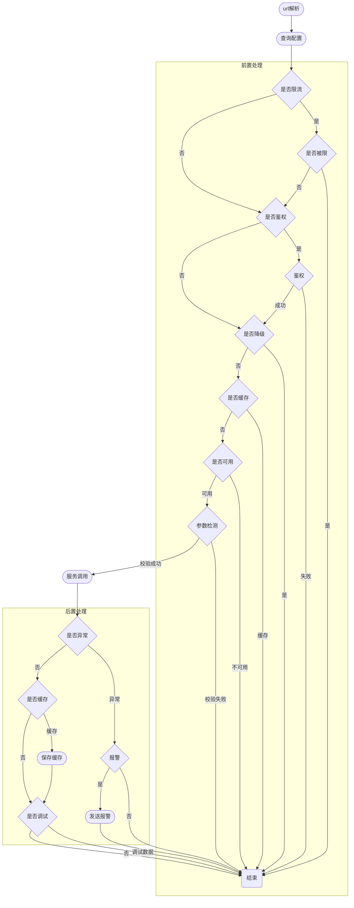
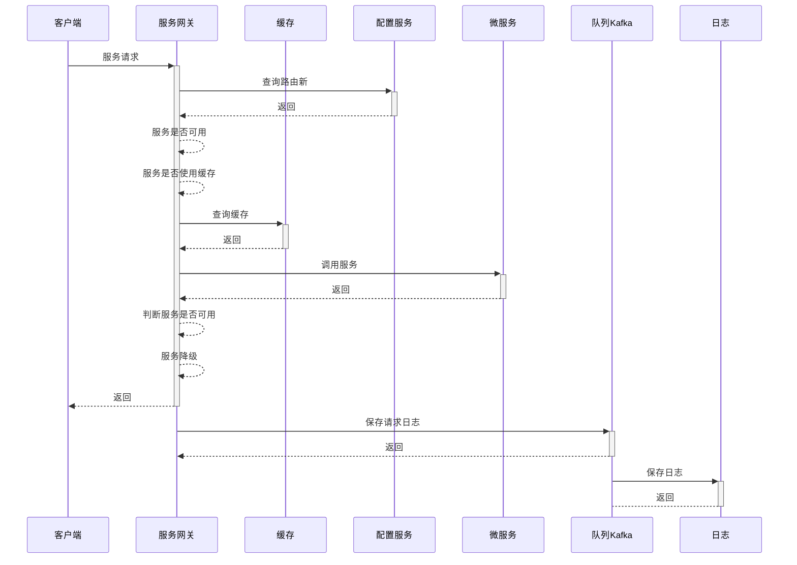
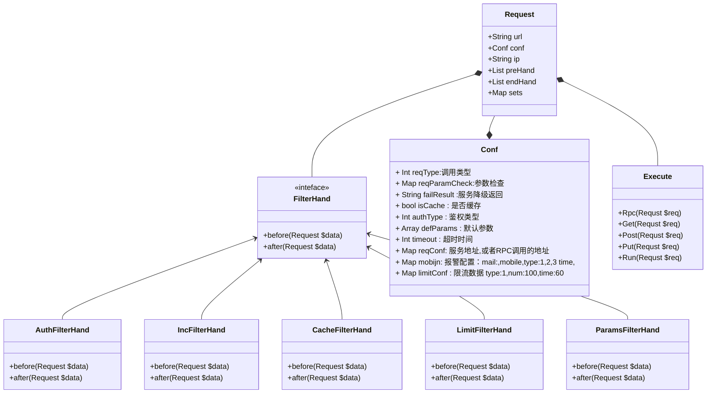
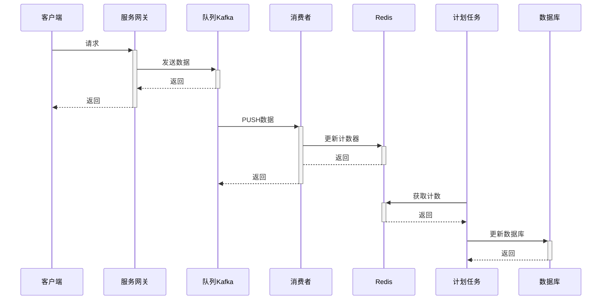
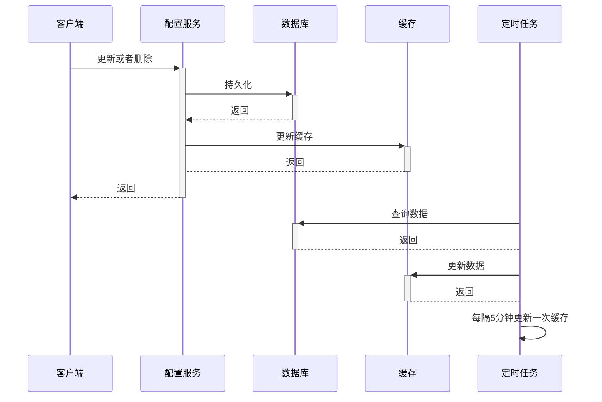

# 核心流程

# 业务流程

# 类图

# v1版本

## 语言选择

PHP + swoole

## 核销功能与服务能力

### 网关

#### 路由规划

Https://ip/服务（RPC服务名字）/ Group （base/Name）/ Module（RPC Buissend Name）/ Action(Buissend Method)

#### 配置同步

+ 配置中心将数据直接写入redis，每隔5分钟刷新一次，在网关这里直接从redis中读取配置信息
+ 配置写入zookeeper 后同步到qconf  （zookeeper 可能没有权限| 单独部署依赖较多，和原有的qconf配置可能有冲突）
+ 网关直接监控配置中心数据变化，然后保存到内存中（部署节点内存占用较大）

#### 计数器

> 使用redis作为计数器的临时保存地址，每日刷新到db
>
> 优选方案 InfluxDB + agent (需要一些基础支持，暂缓，可以在v3版本之后改进)

缓存规划

| key                                              | 类型 | 数据              | 描述                   |
| ------------------------------------------------ | ---- | ----------------- | ---------------------- |
| Api:{日期}:{service}                             | Int  | 0                 | 服务每日               |
| Api:{日期}:{service}:H                           | Hash | {小时:1}          | 每小时的访问量         |
| Api:{日期}:{service}:m                           | Hash | {"小时.分钟" : 1} | 每分钟的访问量         |
| Api:{日期}:{service}:{group}                     | Int  | 1                 | 服务分组每日           |
| Api:{日期}:{service}:{group}:H                   | Hash | {小时:1}          | 服务分组每小时的访问量 |
| Api:{日期}:{service}:{group}:m                   | Hash | {"小时.分钟" : 1} | 服务分组每分钟的访问量 |
| Api:{日期}:{service}:{group}:{module}            | Int  | 0                 | 服务分组每日           |
| Api:{日期}:{service}:{group}:{module}:H          | Hash | {小时:1}          | 服务分组每小时的访问量 |
| Api:{日期}:{service}:{group}:{module}:m          | Hash | {"小时.分钟" : 1} | 服务分组每分钟的访问量 |
| Api:{日期}:{service}:{group}:{module}:{action}   | Int  | 1                 | 服务每日               |
| Api:{日期}:{service}:{group}:{module}:{action}:H | Hash | {小时:1}          | 服务分组每分钟的访问量 |
| Api:{日期}:{service}:{group}:{module}:{action}:m | Hash | {"小时.分钟" : 1} | 服务分组每分钟的访问量 |

#### 缓存

#### 入参检查

1. 参数转换
2. 必填参数检查
3. 参数类型检查（Int.Mobile,Mobile,passwd,date,time,datetime）
4. 参数注入（cookie参数，session参数）

#### 请求安全检查

1. SQL注入检查
2. XSS工具检查

#### 服务调用

### 配置中心

